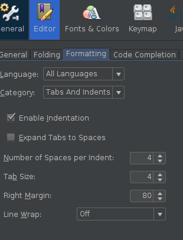
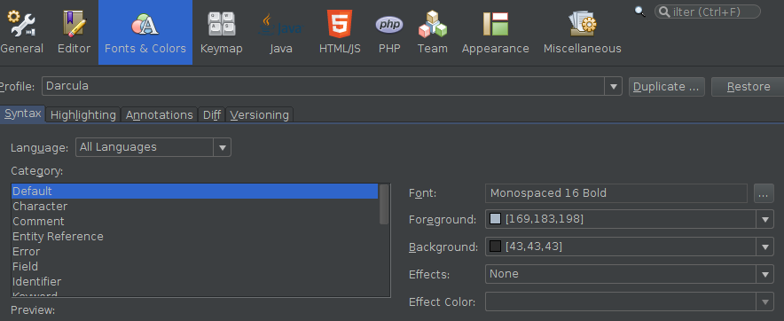
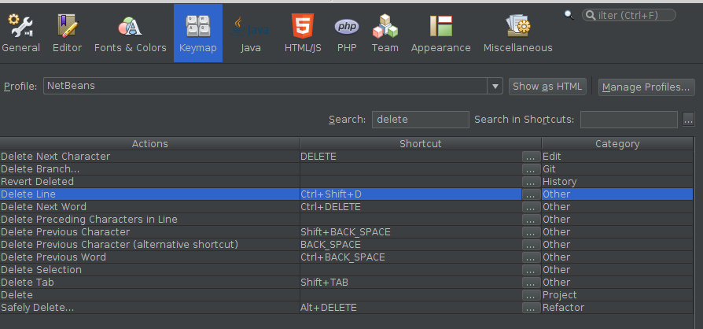
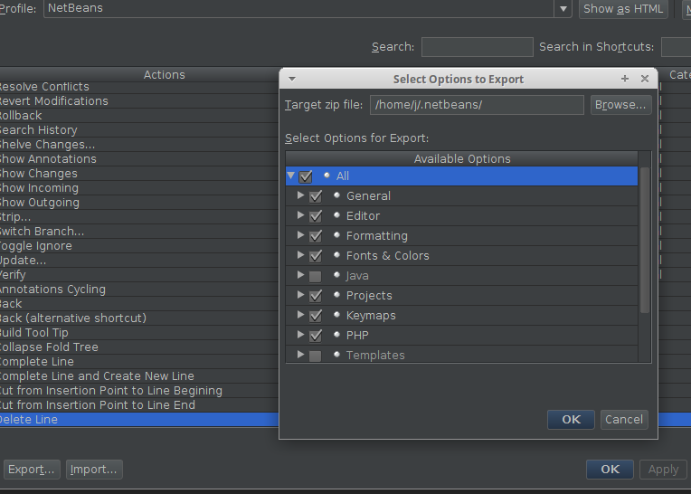

# [Setup and configure Netbeans on ubu 20.04](https://blog.eldernode.com/configure-netbeans-on-ubuntu-20-04/)

```shell
sudo apt install default-jdk -y
sudo snap install netbeans --classic 
```
> netbeans 12.1 from Apache NetBeans✓ installed

## Activate PHP and HTML
* In `Tools/Plugins/Available plugins/` Check PHP, HTML.

## Enable dark theme
* Tools/Plugins/Available plugins/Darcula LAF theme.

## Add MD support
* Markdown Support https://github.com/madflow/flow-netbeans-markdown

## Add Bash / C++
* https://stackoverflow.com/a/1641335
* C++ Plugin.

## Enable [PSR-2 formatting](http://www.php-fig.org/psr/psr-2/) in Netbeans 8.2
* [Download PSR auto-formatting for NetBeans.](https://github.com/allebb/netbeans-psr-formatting#installation)
* Tools/Options/Import
* Check All.

## Vue.js syntax highlight

### [Associate with HTML (stackoverflow.com)](https://stackoverflow.com/a/43216290)

* Options/Miscellaneous/Files
* New File extension -vue.
* Associated File - HTML Files (text/html).

### [Avoid some warnings (blogs.oracle.com)](https://blogs.oracle.com/geertjan/custom-elements-attributes-in-html-in-netbeans-ide)

Put into netbeans/customs.js

```json
{ "elements": {}, "attributes": { "v-if": {}, "@submit.prevent": { "context": "form" }, "@click": {}, "@keyup.enter": {}, "scoped": { "context": "style" }, "v-for": {}, "v-model": {} } }
```

## Load stored settings
* [Downlaod](nb-settings.zip)
* Tools/Options/Import.

## Adjust Tools/Editor/Formatting
* Select 'All Languages' in the 'Language' selector.
* Un-check 'Expand Tabs to Spaces'.
* Set Tab Size to 4 (2 for work).



## Adjust Tools/Fonts & Colors
* Select 'All Languages' in the 'Language' selector.
* Set 'Monospaced 16 Bold'.



## Adjust Tools/Keymap

### Set 'Ctrl + Shift + D' for Delete line
* Search for 'Delete'.
* Select 'Delete Line' row.
* Press 'Ctrl + Shift + D'.



## Export settings /Tools/Export


