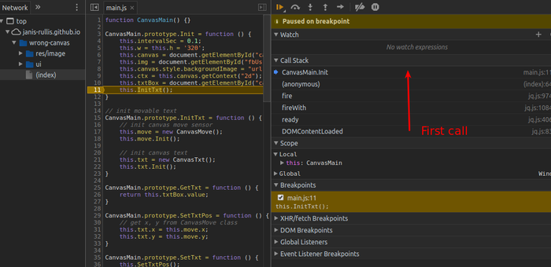

# Chrome devtools

## [Find JavaScript function definition in Chrome](https://stackoverflow.com/a/10912314)

* Ctrl + Shift + F

## [16 Ways to Search, Find and Edit with Chrome DevTools (developer.telerik.com)](https://developer.telerik.com/featured/16-ways-to-search-find-and-edit-with-chrome-devtools/)

## Breakpoints

### Stacktrace direction

Last call (closest to the breakpoint) is at the top



## Elements

### Manipulate in console

* Click on a element.
* Write in console

```js
$0.getAttribute('class');
```

### Copy selector

```css
#content > div.container > div.result-cards-wrapper > div:nth-child(1) > div.result-cards-periods > div.result-card-period > div.item-buttons
```