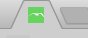
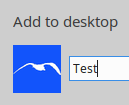
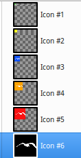

# Favicons

[Favicon cheatsheet (audreyr/favicon-cheat-sheet)](https://github.com/audreyr/favicon-cheat-sheet).

## Create 

[Create multiple size favicons](create.md)

## Test sizes

[This favicon](favicon.ico) has differenet color for each size:

* favicon-16.png - green.
* favicon-32.png -  yellow.
* favicon-64.png - blue.
* favicon-96.png - orange.
* favicon-128.png - red.
* favicon-256.png - black.

Include it in your site and determine the size by color. 

|Place|Image|
|:---|---:|
|Browser||
|Add to homescreen||
|Desktop||
|Folder||

## Check PNG files in the ICO wrapper

Open the .ico file with GIMP. 
All those PNG files will appear as layers.

